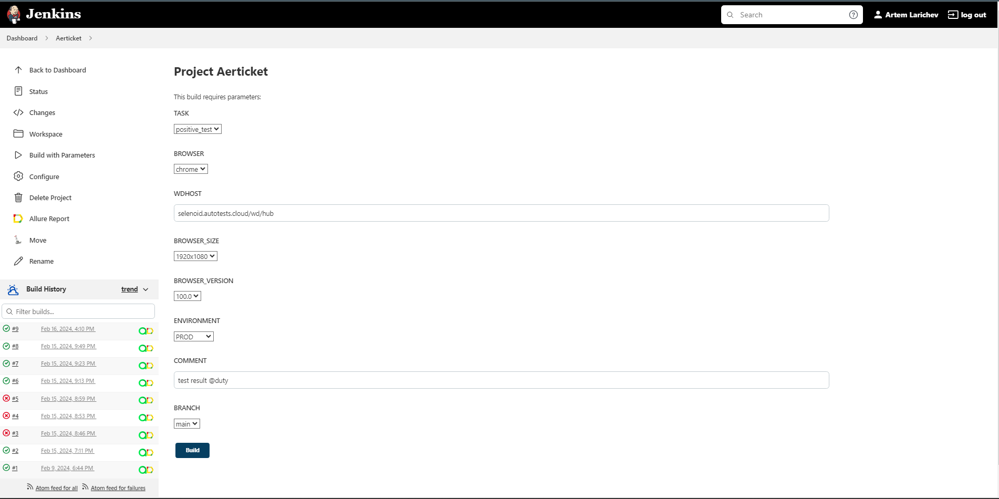
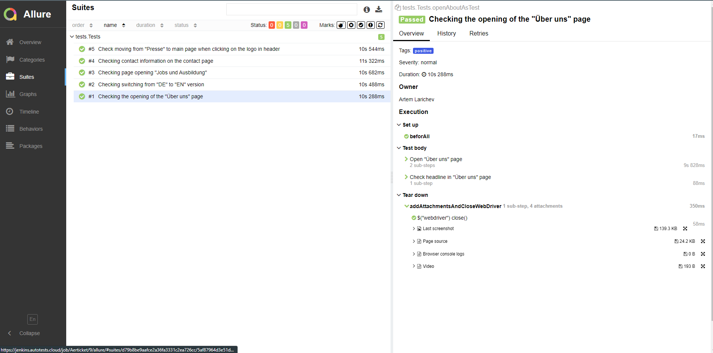
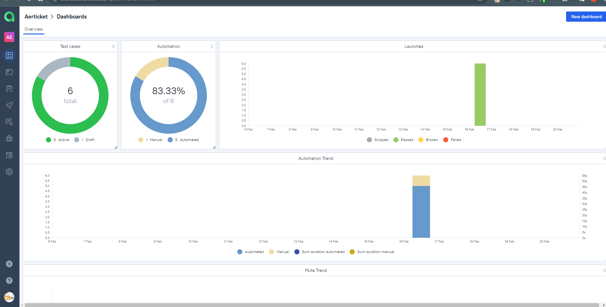
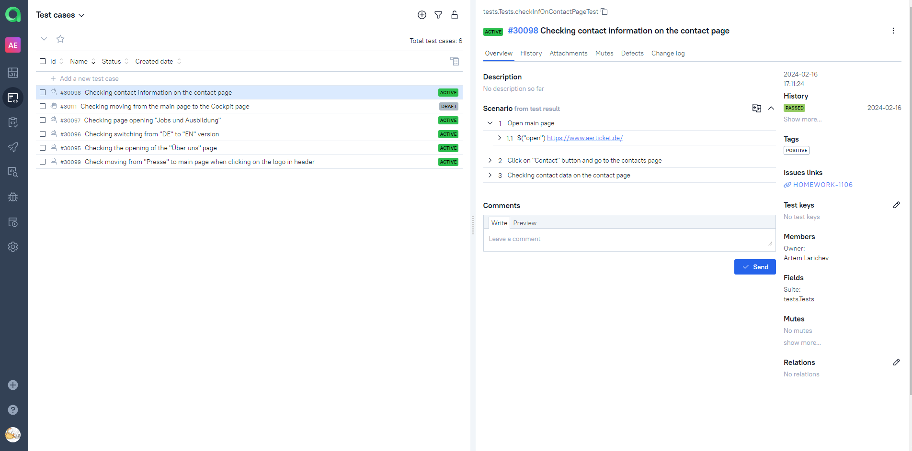
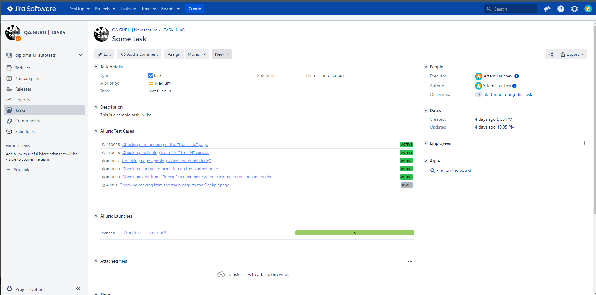
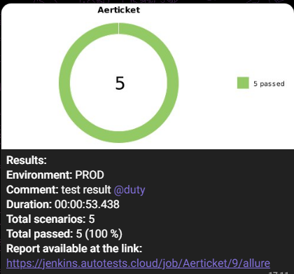
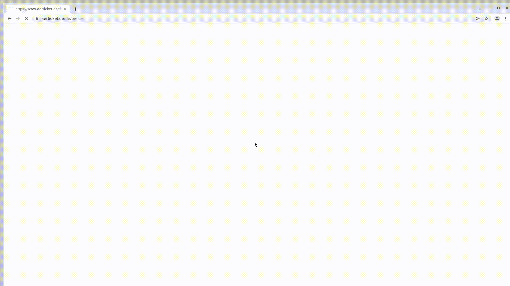

## **[AERTICKET](https://www.aerticket.de//) automation project**


## Content:

- <a href="#tools"> Tools used</a>
- <a href="#cases"> Test Cases</a>
- <a href="#autotests"> Running autotests</a>
- <a href="#jenkins"> Jenkins Build</a>
- <a href="#allureReport"> Example of Allure Report</a>
- <a href="#allure"> Integration with Allure TestOps</a>
- <a href="#jira"> Integration with Jira</a>
- <a href="#telegram"> Telegram notifications</a>
- <a href="#video"> Video Example of Running Tests in Selenoid</a>

____

<a id="tools"></a>
## Tools used

  <p align="center">


---

The tests are written in the <code>Java</code> language using the [Selenide](https://selenide.org/) testing framework, and the build tool is <code>Gradle</code>.

<code>JUnit 5</code> is employed as the framework for modular testing. [Selenoid](https://aerokube.com/selenoid/) is used to run tests remotely.

Tests can be run remotely from <code>Jenkins</code>. After the test run is completed, a report is generated in Allure and sends the results to <code>Telegram</code> using a bot. Integration with <code>Allure TestOps</code> and <code>Jira</code> is also implemented.

Contents of the Allure report for each test case include:

* Test steps and the results of their execution.
* A screenshot of the page on the last step (providing a visual analysis of test failure reasons).
* Page Source (allowing to open the page source in a new tab to investigate the cause of test failure).
* Browser console logs.
* Video recording of the test execution.

---
<a id="cases"></a>
## :male_detective: Test Cases

Automated tests:
* Checking contact information on the contact page
* Checking page opening "Jobs und Ausbildung"
* Checking switching from "DE" to "EN" version
* Checking the opening of the "Über uns" page
* Checking moving from "Presse" to main page when clicking on the logo in header

Manual test:
* Checking moving from the main page to the Cockpit page

---
<a id="autotests"></a>
## :arrow_forward: Running autotests

### Running autotests from the terminal

#### Local run from the project root directory
Сommand for running positive cases:
```
gradle clean positive 
```
---
<a id="jenkins"></a>
##  </a> Jenkins Build <a target="_blank"> </a>

To access Jenkins, registration on the [Jenkins](https://jenkins.autotests.cloud/) platform is required.

###  Build parameters in Jenkins:

- TASK (set of tests to run)
- URL (address of the main page of the tested website)
- WDHOST (address of the remote server where tests will be executed)
- BROWSER_SIZE (browser window size, default is 1920x1080)
- BROWSER_VERSION (browser version, default is 100.0. Supports running in Firefox versions 98.0 and 97.0, as well as Chrome 99.0 and 100.0)
- BROWSER (browser, default is chrome)
- ENVIRONMENT (added to demonstrate,default is prod)
- COMMENT (comments added to notification in Telegram)
- BRANCH (added to demonstrate,default is main)


<p align="center">

</p>

After the build is completed, in the <code>Build History</code> section, icons for <code>Allure Report</code> and <code>Allure TestOps</code> will appear next to the build number. Clicking on these icons will open a page with the generated HTML report and corresponding test documentation, respectively.

---

<a id="allureReport"></a>
##  </a> Allure report <a target="_blank" href="https://jenkins.autotests.cloud/job/Aerticket/9/allure/#">  example</a>

<p align="center">

</p>


---

<a id="allure"></a>
##  </a> Integration with с <a target="_blank" href="https://allure.autotests.cloud/project/4042/dashboards"> Allure TestOps </a>


On the Dashboard in <code>Allure TestOps</code>, you can see statistics on the number of tests: how many of them are added and executed manually, and how many are automated. New tests, as well as the results of the test run, are received through integration with each build execution.

 ---

<p align="center">

</p>

<p align="center">

</p>

 ---

<a id="jira"></a>
##  </a> Integration with <a target="_blank" href="https://jira.autotests.cloud/browse/HOMEWORK-1106"> Jira </a>


Integration of <code>Allure TestOps</code> with <code>Jira</code> is implemented. The task displays which test cases were written as part of the task and the results of their execution.

<p align="center">

</p>

---

<a id="telegram"></a>
##  Telegram notifications

After the build is completed, the Telegram bot created in <code>Telegram</code> automatically processes and sends a message with the test run report to a specifically configured chat.

<p align="center">

</p>

<a id="video"></a>

##  Video Example of Running Tests in Selenoid

In the Allure reports, for each test, not only a screenshot but also a video of the test execution is attached.

<p align="center">
  
</p>


